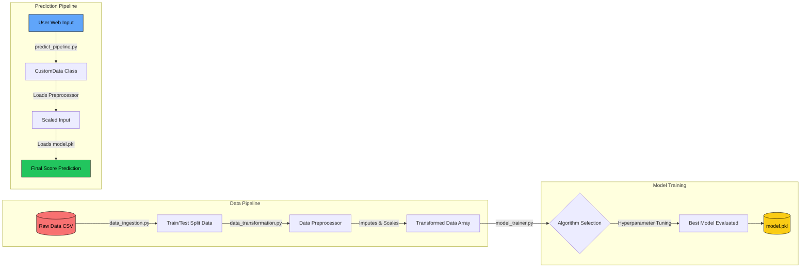

# 🎓 EduMetrics: End-to-End Student Performance Analysis

[](https://python.org)
[](https://flask.palletsprojects.com/)
[](https://www.docker.com/)
[](https://render.com/)
[](https://github.com/features/actions)

EduMetrics is a comprehensive, end-to-end Machine Learning web application designed to predict and analyze student performance. It features a robust ML pipeline under the hood, wrapped in a stunning, modern **Neo-Brutalist** user interface. 

---

## 🌟 Key Features

*   **🎯 Score Prediction**: Predict a student's math score based on features like gender, ethnicity, parental education, lunch type, test preparation, and other subject scores.
*   **📊 Interactive Analytics Dashboard**: A rich, visual dashboard built with Chart.js to explore the dataset. View distributions, correlations, and performance breakdowns by demographic.
*   **🧠 Dynamic Model Training**: Trigger the ML pipeline directly from the UI to retrain the model. Evaluates multiple algorithms (Random Forest, XGBoost, CatBoost, etc.) and visualizes feature importances live.
*   **📄 PDF Report Generation**: Export beautiful, styled PDF reports of both your single-student predictions (including dynamic advice) and the full analytics dashboard with one click.
*   **🎨 Neo-Brutalist UI/UX**: A highly stylized, high-contrast, responsive interface with custom CSS variables, sharp drop shadows, bold typography, and smooth micro-animations.

---

## 🛠️ Technology Stack

**Machine Learning & Data Processing:**
*   `scikit-learn`, `pandas`, `numpy`
*   `xgboost`, `catboost`
*   Custom modular pipeline (Data Ingestion, Transformation, Model Trainer)

**Backend:**
*   `Flask` (Python Web Framework)
*   `joblib` / `dill` (Model serialization)

**Frontend:**
*   HTML5, Vanilla CSS3 (Custom Neo-Brutalist styling)
*   JavaScript, `Chart.js` (Visualizations), `html2pdf.js` (Client-side PDF generation)

**DevOps & Deployment:**
*   **Docker**: Containerized for consistency across environments.
*   **GitHub Actions**: Automated CI/CD pipeline for linting, testing, and continuous deployment.
*   **Render**: Fully deployed cloud hosting.

---

## 🏗️ Architecture & Process Flow

Understanding how EduMetrics processes data from raw ingestion to the final web prediction.

### Machine Learning Process Flow

This flowchart breaks down the internal `src/` modules. It explains how raw data is ingested, transformed, and finally passed to the model trainer.



### Process Flow Explainer

1. **Data Ingestion**: The `DataIngestion` component reads the raw dataset (CSV format), splits it into training and testing sets, and stores them in the artifacts directory.
2. **Data Transformation**: The `DataTransformation` component takes the split data, applies transformations (like handling missing values, encoding categorical variables, and scaling numerical variables), and saves this logic as `preprocessor.pkl`.
3. **Model Training**: The `ModelTrainer` script receives the transformed arrays. It trains multiple regression models (XGBoost, CatBoost, Random Forest, etc.), tunes hyperparameters, selects the model with the highest R² score, and saves it as `model.pkl`.
4. **Prediction**: When a user inputs their data on the web UI, the `PredictPipeline` loads both `preprocessor.pkl` and `model.pkl`. It scales the incoming user data, runs it through the model, and returns the predicted score in real-time.

---

## 📂 Project Structure

```text
├── app.py                      # Flask Application entry point
├── requirements.txt            # Python dependencies
├── Dockerfile                  # Docker image configuration
├── .github/workflows/          # GitHub Actions CI/CD workflows
├── artifacts/                  # Serialized ML models and preprocessors (e.g., model.pkl)
├── notebook/                   # Jupyter notebooks for EDA and model experimentation
├── src/                        # Core Machine Learning package
│   ├── components/             # Ingestion, Transformation, and Trainer modules
│   ├── pipeline/               # Training and Prediction pipeline logic
│   ├── logger.py               # Custom logging configuration
│   └── exception.py            # Custom exception handling
└── templates/                  # HTML/CSS Frontend templates
    ├── base.html               # Global layout and Neo-Brutalist CSS styling
    ├── home.html               # Prediction interface & report generator
    ├── analytics.html          # Interactive Chart.js dashboard
    └── train.html              # Dynamic model retraining UI
```

---

## 🚀 Getting Started (Local Development)

### Prerequisites
Make sure you have [Python 3.10+](https://www.python.org/downloads/) and optionally [Docker](https://www.docker.com/products/docker-desktop/) installed on your machine.

### 1. Clone the repository
```bash
git clone https://github.com/yourusername/endTOendMLPROJECT.git
cd endTOendMLPROJECT
```

### 2. Create and activate a virtual environment
```bash
python -m venv .venv

# On Windows:
.venv\Scripts\activate
# On macOS/Linux:
source .venv/bin/activate
```

### 3. Install dependencies
```bash
pip install -r requirements.txt
```

### 4. Run the ML Pipeline (Optional)
If you want to train the models from scratch and generate the `model.pkl` and `preprocessor.pkl` files:
```bash
python src/pipeline/train_pipeline.py
```
*(Alternatively, you can just click the "Start Training" button from the UI later!)*

### 5. Start the Flask application
```bash
python app.py
```
Visit `http://127.0.0.1:5000` in your browser.

---

## 🐳 Running with Docker

You can also run the application using Docker, ensuring an identical environment to production.

```bash
# Build the Docker image
docker build -t edumetrics-app .

# Run the container
docker run -p 5000:8080 edumetrics-app
```
*(Note: The Dockerfile exposes port 8080, adjust mapping as necessary depending on your environment).*


